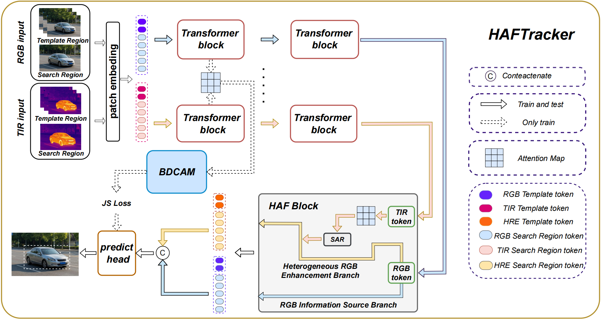

# "HAFTrack:Heterogeneous Asymmetric Fusion in RGBT Tracking"
> **📢 Note:** The testing code and pre-trained weights are now available! The training code will be released upon the acceptance of our paper. Stay tuned!
## Introduction
  

This repository contains the official implementation of the RGBT (RGB-Thermal) object tracking algorithm proposed in our paper "HAFTrack:Heterogeneous Asymmetric Fusion in RGBT Tracking". Our method proposed a novel multimodal tracking framework, termed HAFTrack, which is specifically designed to accommodate the intrinsic characteristics of RGB and TIR modalities as well as the fundamental requirements of RGBT tracking, thereby fully exploiting the high-value information provided by both modalities.

## Device
We trained and tested our model on four NVIDIA RTX 4090 GPUs.

## Environment Configuration
### Prerequisites
Our code has been tested in the following environment:
* Python >= 3.8
* PyTorch >= 1.10.1
* CUDA >= 11.3

### Install Dependencies
First, clone this repository：
```bash
git clone https://github.com/DurianLatte913/HAFTrack-main.git
```
Install the required packages using the provided `requirements.txt`:
```bash
pip install -r requirements.txt
```

## Dataset Preparation
Our tracker supports the following standard RGBT tracking datasets. Please download the datasets and organize them according to the specified directory structure.
### Supported Datasets
- RGBT210
- RGBT234
- LasHeR
- VTUAV

Put the tracking datasets in ./data. It should look like this:
```bash
${PROJECT_ROOT}
 -- data
     -- RGBT210
         |-- afterrain
         |-- aftertree
         ...
     -- RGBT234
         |-- green
         |-- glass
         ...
     -- LasHeR
         |-- train
         |-- test
     -- VTUAV
         |-- train
         |-- test
```

## Train
⏳ **Coming Soon!** The full training code and scripts will be open-sourced upon the acceptance of our paper.

## Test
To test the model, you can use our pre-trained weights. Place the weights in the ./output/checkpoints/ directory.
```bash
cd HAFTrack-main
bash ./experiments/haftrack/test210.sh      #test RGBT210
bash ./experiments/haftrack/test234.sh      #test RGBT234
bash ./experiments/haftrack/test_lasher.sh  #test LasHeR
bash ./experiments/haftrack/testuav.sh      #test VTUAV
```

## Evaluation
You can use the evaluation script provided in './eval_tracker/' to evaluate the metrics on RGBT210, RGBT234, and LasHeR. For the VTUAV dataset, we recommend using the official toolkit.

## Pre-trained Weights and Results
We provide the pre-trained weights of our tracker for quick testing. Download the weights from the following links:

- Baidu Cloud:  [Weights and Results](https://pan.baidu.com/s/1x0lf_7GIDRwtXF_ZacOFXg?pwd=tjd1) 


- Google Drive: [Weights and Results](https://drive.google.com/drive/folders/1vdBTliSHx1RALrUjWF12R-TPf_gyW6o2?usp=drive_link)

## Acknowledgements
We would like to thank the authors of the following datasets and open-source projects for their valuable contributions:

- RGBT210, RGBT234, LasHeR, and VTUAV.

- PyTorch, OpenCV, and other open-source libraries.

- OSTrack
